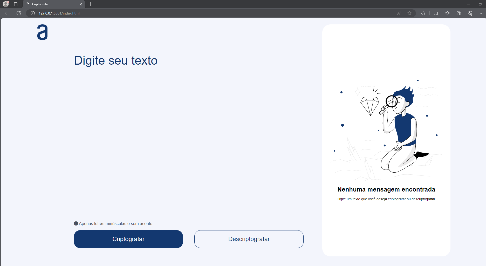
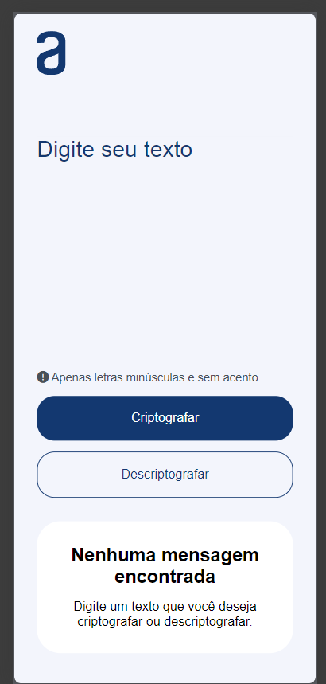

# Challenge-one

Challenge ONE - Lógica de Programação - Decodificador de Texto.
Este é um aplicativo simples de criptografia e descriptografia de mensagens. Ele utiliza um algoritmo de substituição para criptografar e descriptografar o texto inserido, substituindo determinadas letras por sequências específicas.
## Índice
- <a href="#projeto">Acesse o Projeto 🔗</a>
- <a href="#comousar">Como usar 🚀</a>
- <a href="#restricao">Restrições ⚠️</a>
- <a href="#layout">Layout Responsivo 📱</a>
- <a href="#tecnologias">Tecnologias Utilizadas 💻</a>
- <a href="#pre-requisitos">Pré-requisitos ⚙️</a>
- <a href="#licenca">Licença 📜</a>

## Acesse o Projeto

[Visualize o Projeto Aqui](https://jeferson-labout.github.io/Challenge-one/)

## Como usar

1. Acesse o aplicativo em um navegador web.
2. Insira o texto que você deseja criptografar na área de entrada.
3. Clique no botão "Criptografar" para transformar o texto.
4. Para descriptografar, insira o texto criptografado e clique no botão "Descriptografar".
5. Utilize o botão "Copiar" para copiar o resultado.

## Restrições

- O aplicativo suporta apenas letras minúsculas e sem acento.
- Caracteres especiais e maiúsculas não são permitidos.

## Layout Responsivo

### Modo desktop

### Modo mobile

O layout do aplicativo é responsivo, adaptando-se a diferentes tamanhos de tela para oferecer uma experiência consistente.

## Tecnologias Utilizadas

- HTML
- CSS
- JavaScript

## Pré-requisitos

Certifique-se de ter um navegador web atualizado para garantir a melhor experiência de uso.

## Licença

Este projeto é licenciado sob a [Licença MIT](./LICENSE).